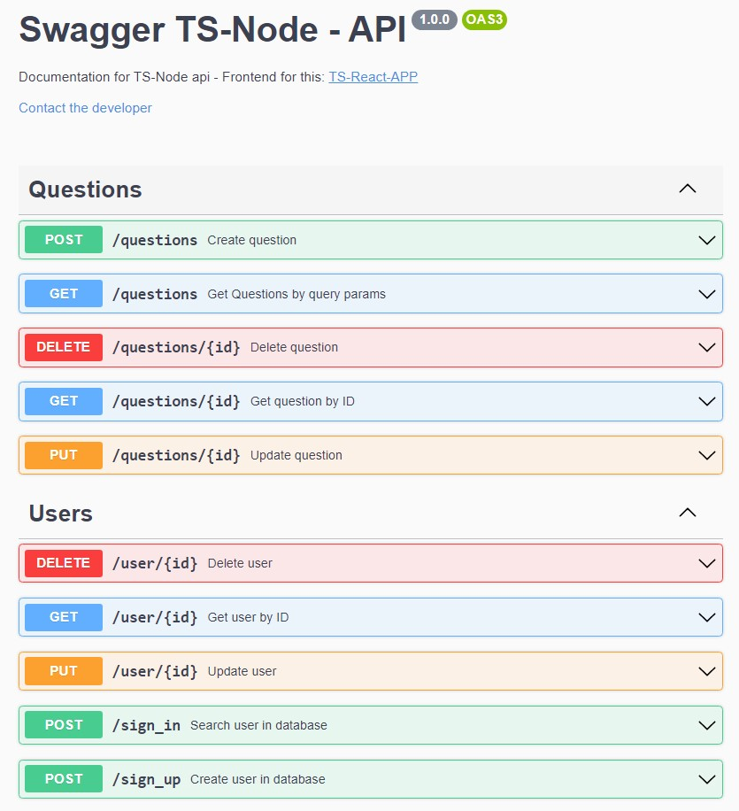

<h1 align="center">
  
</h1>

<br>

<p align="center">API made with JS, TS, Node and Mongodb 🤓</p>

<p align="center">
  
</p>

<br>

<h2 align="center">

[](https://skills.thijs.gg)

</h2>

<br>

<p align="center">🚀 This API is part of the DevHelper project, its Frontend can be found here » <h2 align="center"><a href="https://github.com/roberiodutra/ts-react-app">TS-REACT-APP</a></h2></p>

<br>

<h4 align="center">
	🚧  TS-Node-API 🚀 under construction...  🚧
</h4>

<p align="center">
 <a href="#features">Features</a> •
 <a href="#technologies">Technologies</a> •
 <a href="#prerequisites">Prerequisites</a> •
 <a href="#author">Author</a>
</p>

<br>

### Features

- [x] DB CRUD in Users and Questions
- [x] Unitary tests
- [x] Documented with Swagger

<br>

### Technologies

The following tools were used in building this API:

- [Node.js](https://nodejs.org/en/)
- [Javascript]()
- [TypeScript]()
- [MongoDB]()
- [Mongoose]()
- [Express]()
- [Mocha]()
- [JsonWebToken]()
- [Sucrase]()
- [Bcrypt]()
- [Swagger]()
- [Zod]()

<br>

### Prerequisites

Before starting, you will need to have the following tools installed on your machine:
[Git](https://git-scm.com), [Node.js](https://nodejs.org/en/).
Besides, it's good to have an editor to work with the code like [VSCode](https://code.visualstudio.com/)

### 🎲 Running the BackEnd (server)

```bash
# Clone this repository
$ git clone <git@github.com:roberiodutra/ts-node-api.git>

# Access the project folder in terminal/cmd
$ cd ts-node-api

# Install the dependencies
$ npm install

# Run the application in development mode
$ npm run dev

# The server will start on port:3001 - access <http://localhost:3001>
```

<br>

### Author

<a
  href="https://www.linkedin.com/in/roberiodutra/"
  rel="nofollow">

</a>

<br>

📝 License

This project is under license <a href="/LICENSE">MIT</a>.
